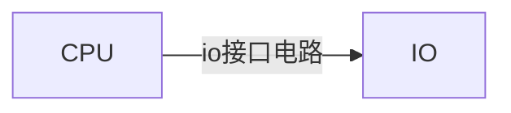

### 绪论

> 额好像没啥用。存一下

+ 计算机核心微机

  ```mermaid
  graph LR
  A[外界提供物理量]--传感器-->B[电量]
  B[电量]--滤波、放大（前端调理电路）
  ADC-->C[CPU]
  C[CPU]--DAC
  放大、滤波（后端）-->D[外界]
  ```

+ 计算系统组成

  + 硬件

    + 控制器 

    + 算数逻辑运算单元ALU

      > 中央处理器、微处理器、cpu芯片

    + 存储器

    + io设备

    > 信息：数据信息DB、地址信息AB、控制信息CB

    > 总线：用来传输信息的通道

  + 微型计算机硬件
    + CPU
    + 系统级总线-->系统总线
    + 存储器 RAM(数据存储器) ROM (程序存储器)





